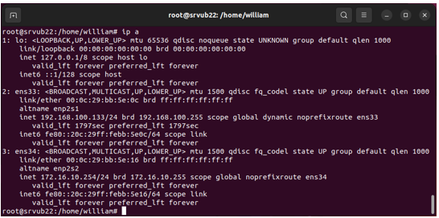
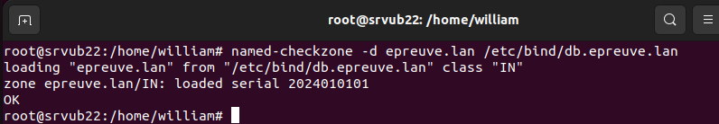
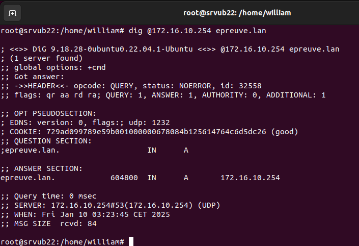
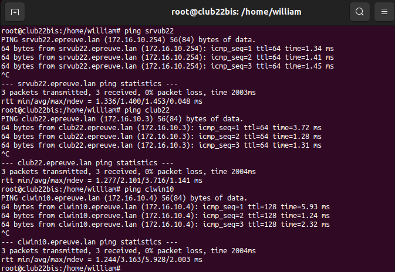
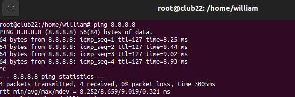

# Serveur DHCP & Serveur DNS - Cas pratique 

## Informations

| Champ           | Détails                                      |
|-----------------|----------------------------------------------|
| **Auteur**      | William Mbakop                               |
| **Profession**  | étudiant en alternance - BTS SIO SISR        |
| **Version**     | 1.0.0                                        |
| **Date**        | 9 janvier 2025                               |
| **Description** | Serveur DHCP & Serveur DNS - Cas pratique                |

## Architecture

La VM serveur srvub22 fera office de serveur DHCP et DNS.

Les VM clientes club22 et clwin10 seront connectées au serveur DHCP pour obtenir une adresse ip automatique dans la plage d’adresse 172.16.10.3 à 172.16.10.9 (configurée dans le serveur DHCP). 
Elles obtiendront la résolution de nom (epreuve.lan) par le serveur DNS.

La VM cliente club22bis sera connectée au serveur DHCP pour obtenir une adresse ip statique 172.10.16.10 (configurée dans le serveur DHCP). 
Elle obtiendra la résolution de nom (epreuve.lan) par le serveur DNS.


## Réglage des switches virtuels sur VMWare WorkStation Pro 17

Pour cette configuration, Nous aurons deux switches virtuels :
- VMnet1 qui servira de réseau local
- VMnet8 qui nous permettra d’aller sur internet

### Explication

Les interfaces vmnet1 et vmnet8 sont des interfaces réseau virtuelles créées par VMware Workstation pour la gestion des connexions réseau entre les machines virtuelles (VM) et le système hôte. 

Ces interfaces permettent à VMware de simuler différents types de réseaux pour les machines virtuelles. Voici une explication détaillée de chaque interface :

#### vmnet1 : Réseau hôte-unique (Host-Only)

- Type de réseau : Host-Only (Hôte-Uniquement).

- Description : Cette interface permet aux machines virtuelles de communiquer uniquement entre elles et avec l'hôte (le système physique). Aucun accès à Internet ou au réseau externe n'est fourni via cette interface.

- Utilisation : Elle est utile lorsque vous souhaitez créer un réseau isolé entre vos machines virtuelles et l'hôte, mais sans qu'elles ne soient accessibles depuis le réseau local ou Internet.

- Exemple d'utilisation : Tester des configurations réseau internes sans interaction avec le monde extérieur.

2. vmnet8 : Réseau NAT (Network Address Translation)

- Type de réseau : NAT (Network Address Translation).

- Description : Cette interface permet aux machines virtuelles de se connecter à Internet ou à d'autres réseaux externes via l'hôte, en utilisant la translation d'adresses réseau (NAT). Cela signifie que les machines virtuelles peuvent accéder à Internet, mais les connexions entrantes ne sont pas directement accessibles depuis l'extérieur.

- Utilisation : Elle est idéale lorsque vous souhaitez permettre aux machines virtuelles d'accéder à Internet sans exposer leurs adresses IP internes au monde extérieur.

- Exemple d'utilisation : Accéder à Internet dans une machine virtuelle tout en maintenant une certaine sécurité, car l'hôte gère l'accès externe.


## Configuration de la VM Serveur srvub22

### Installation

Pour la création de la machine virtuelle, se référer à la documentation suivante :
- [Création Machine virtuelle](https://github.com/WilliamMbakop/bts-sisr-installation-machine-virtuelle-vmware-worsktation-pro-17/blob/master/creation_machine_virtuelle.md)

Les caractéristiques de la VM srvub22 sont les suivantes :
- [ISO Ubuntu 22.04.05](https://releases.ubuntu.com/jammy/ubuntu-22.04.5-desktop-amd64.iso)
- Ram 4 Go
- Network adaptator1 : NAT (VMNet8)
- Network adaptator2 : VMnet1
- Décocher Accélération 3D graphics

### Mise à jour et mise à niveau

```bash
# Passer en mode superutilisateur (root) en utilisant les privilèges de l'utilisateur courant
sudo su

# Ouvrir le terminal
ctrl + alt + t

# Se mettre 

# Créer un fichier vide nommé script.sh
touch script.sh

# Changer les permissions du fichier script.sh pour que tout le monde puisse lire, écrire et exécuter
chmod 777 script.sh 

# Ouvrir le fichier script.sh dans l'éditeur de texte nano
nano script.sh
``` 

Renseigner les lignes ci-dessous dans le fichier :

```bash
# Mettre à jour la liste des paquets disponibles à partir des sources configurées
apt update -y

# Effectuer une mise à niveau de distribution, incluant des mises à jour de paquets et des changements de dépendances
apt dist-upgrade -y

# Installer le programme "tasksel" qui permet d'installer des tâches prédéfinies pour une configuration plus facile
apt install tasksel -y

# Installer le serveur SSH, permettant l'accès à distance sécurisé via SSH
apt install openssh-server -y

# Installer les outils Open VM Tools, nécessaires pour les machines virtuelles VMware
apt install open-vm-tools -y

# Installer le serveur web Apache2
apt install apache2 -y

# Installer le langage de programmation PHP
apt install php -y

# Installer le module PHP pour MySQL, permettant l'interaction entre PHP et MySQL
apt install php-mysql -y

# Installer PHP en ligne de commande (CLI), permettant l'exécution de scripts PHP depuis le terminal
apt install php-cli -y

# Installer le serveur de base de données MySQL
apt install mysql-server -y

# Installer phpMyAdmin pour gérer MySQL via une interface web
apt install phpmyadmin -y

# Installer le serveur DNS BIND9
apt install bind9 -y && apt install bind9utils -y && apt install bind9-doc -y

# Installer dnsutils 
# dnsutils contient plusieurs outils utiles pour diagnostiquer et interagir avec les systèmes de noms de domaine (DNS).
# les outils sont dig, nslookup, dnsdomainname

apt install dnsutils -y

# Installe le service de partage de fichiers Samba
apt install samba -y

# Installer le serveur DHCP ISC, qui attribue des adresses IP aux clients du réseau
apt install isc-dhcp-server -y

# Installer le programme "tree" pour afficher les répertoires sous forme d'arborescence
apt install tree -y
```

```bash

# Enregistrer et fermer le fichier
ctrl + o
entrée
ctrl + x

# Exécuter le script script.sh
./script.sh
```

### Configuration des interfaces

NB : À partir de la version Ubuntu 17.10 (Artful Aardvark), la configuration réseau par défaut est passée de l'utilisation de interfaces à l'utilisation de Netplan avec des fichiers de configuration situés dans /etc/netplan/, comme /etc/netplan/01-network-manager-all.yaml. 

Netplan simplifie la configuration réseau en utilisant des fichiers YAML pour définir les interfaces réseau et leurs paramètres.


```bash
# Afficher les informations sur les interfaces réseau et leurs adresses IP
ip a
```


```bash
# Ouvrir le fichier /etc/netplan/01-network-manager-all.yaml
sudo nano /etc/netplan/01-network-manager-all.yaml
```

```bash
# Renseigner le code suivant. Attention à l'identifiant de la seconde carte réseau :
network:
    version: 2
    renderer: NetworkManager
    ethernets:
        ens33:
            dhcp4: true
            optional: true
        ens34:
            dhcp4: false
            addresses:
                - 172.16.10.254/24
            nameservers:
                addresses:
                    - 172.16.10.254
                search:
                    - epreuve.lan

```

NB: Renseigner "search" permet à tous les clients du réseau local d’utiliser automatiquement le domaine epreuve.lan lorsqu'ils résolvent des noms de domaine. Ainsi, par exemple les machines du réseau peuvent résoudre des noms de type srvub22 en srvub22.epreuve.lan  ou club22 en club22.epreuve.lan sans avoir besoin de spécifier le domaine complet. 

```bash
# Changer les permissions du fichier de configuration réseau pour qu'il soit lisible et modifiable uniquement par le propriétaire
sudo chmod 600 /etc/netplan/01-network-manager-all.yaml

# Appliquer les configurations réseau définies dans les fichiers de configuration Netplan
sudo netplan apply

# Observer les changements effectués 
ip a
```


### Configuration de la résolution locale des noms d'hôte en adresses IP 

```bash
# Ouvrir le fichier /etc/hosts 
nano /etc/hosts
```

Ajouter ces lignes

```bash
127.0.0.1       localhost
172.16.10.254   srvub22.epreuve.lan     srvub22
172.16.10.3     club22.epreuve.lan      club22
172.16.10.6     clwin10.epreuve.lan     clwin10 
172.16.10.10    club22bis.epreuve.lan   club22bis
8.8.8.8         www.google.fr
8.8.4.4         www.google.fr
```
```bash
# Redémarrer le service NetworkManager pour appliquer les changements de configuration réseau
systemctl restart NetworkManager
```

Si on se pingue par exemple, on voit que ca fonctionne :


### Activation du Forwarding et de la translation d'adresses (NAT)

```bash
# Ouvrir le fichier /etc/sysctl.conf
sudo nano /etc/sysctl.conf

    # Décommenter :
    net.ipv4.ip_forward=1

# NB : La commande net.ipv4.ip_forward=1 active le forwarding en permettant au système de transférer les paquets entre différentes interfaces réseau, ce qui est nécessaire pour le routage, et prépare le serveur à utiliser la translation d'adresses (NAT) en modifiant les adresses IP source des paquets pour permettre l'accès à Internet via une adresse publique. 

# Recharger les paramètres de configuration du noyau à partir du fichier /etc/sysctl.conf
sudo sysctl -p
```

### Configuration du Masquage avec IPTABLES

```bash
# Ajouter une règle NAT pour masquer les adresses IP source des paquets sortants sur l'interface ens33. Cela assure que tout le trafic sortant de la VM cliente passe par l’interface ens33 du serveur et est correctement masqué. 
sudo iptables -t nat -A POSTROUTING -o ens33 -j MASQUERADE

# Installer le paquet iptables-persistent pour sauvegarder les règles iptables
sudo apt install iptables-persistent -y

# Répondre OUI aux deux questions
```

### Configuration du serveur DHCP (isc-dhcp-server)

#### Paramétrage des directives qui définissent le comportement du serveur DHCP

```bash
# Ouvrir le fichier de configuration DHCP dans l'éditeur de texte nano
sudo nano /etc/dhcp/dhcpd.conf
```

Modifier :

```bash
option domain-name "epreuve.lan";
option domain-name-servers srvub22.epreuve.lan;

default-lease-time 86400;
max-lease-time 604800;

```

Modifier :

```bash
    ddns-update-style interim;
```

Décommenter :

```bash
authorithative
```

Ajouter :

```bash
subnet 172.16.10.0 netmask 255.255.255.0 {
    deny client-updates;
    one-lease-per-client on;
    option routers 172.16.10.254;
    option broadcast-address 172.16.10.255;

    pool {
        deny dynamic bootp clients;
        host club22 { hardware ethernet 00:0c:29:6e:bf:14; fixed-address 172.16.10.10;}
        range 172.16.10.3 172.16.10.9;
    }

    # Mise à jour automatique DNS pour les clients
    ddns-updates on;
    update-static-leases on;
}
```

#### Configuration de l'interface réseau à écouter

```bash
# Ouvrir le fichier de configuration du serveur DHCP ISC dans l'éditeur de texte nano
sudo nano /etc/default/isc-dhcp-server

    # Modifier : 
    INTERFACESv4="ens34"

    # Supprimer : 
    INTERFACESv6=""

# Redémarrer le service DHCP ISC pour appliquer les nouvelles configurations et vérifier son statut
sudo systemctl restart isc-dhcp-server && sudo systemctl status isc-dhcp-server

# En cas de présente d'erreur pour analyser l'erreur :
cat /var/log/syslog | grep dhcpd 
# ou
cat /var/log/syslog | grep 50622
```


### Configuration du serveur DNS (bind9)

#### Définition des zones DNS

Les zones DNS servent à organiser et gérer la correspondance entre les noms de domaine (comme srvub22.epreuve.lan) et leurs adresses IP, en permettant la résolution des noms au sein d'un domaine spécifique.


```bash
# Ouvrir le fichier de configuration local de BIND : /etc/bind/named.conf.local. Il sert à définir les zones DNS locales et à configurer des fichiers de zone spécifiques pour un serveur DNS Bind9, permettant ainsi la gestion des domaines et de leurs enregistrements. 
sudo nano /etc/bind/named.conf.local
```
Ajouter ces lignes :

```bash
zone "epreuve.lan" {
    type master;
    file "/etc/bind/db.epreuve.lan";
    allow-update { any; };
};

zone "10.16.172.in-addr.arpa" {
    type master;
    file "/etc/bind/rev.epreuve.lan";
    allow-update { any; };
};

# NB : allow-update { any; }; permet d'autoriser n'importe quel client à effectuer des mises à jour dynamiques des enregistrements DNS sur le serveur.
```
#### Création de la zone directe

La zone directe permet de résoudre un nom de domaine en adresse IP (par exemple, srvub22.epreuve.lan → 192.168.1.10).

```bash
# Ouvrir le fichier de zone DNS pour epreuve.lan 
sudo nano /etc/bind/db.epreuve.lan

# Ajouter le code ci-dessous : 

$TTL    604800
@       IN      SOA     srvub22.epreuve.lan. root.epreuve.lan. (
                        2025011161 ; Serial
                        1W         ; Refresh
                        1d         ; Retry
                        4W         ; Expire
                        1W )       ; Negative Cache TTL

        IN      NS      srvub22.epreuve.lan.
        IN      A       172.16.10.254
www     IN      A       172.16.10.254

srvub22  IN      A       172.16.10.254
club22   IN      A       172.16.10.3
club22bis IN     A       172.16.10.10
clwin10  IN      A       172.16.10.5
```

#### Création de la zone inversée

La zone inversée permet de résoudre une adresse IP en son nom de domaine associé (par exemple, 192.168.1.10 → srvub22.epreuve.lan). 

```bash
# Ouvrir le fichier de zone inversée DNS pour epreuve.lan
sudo nano /etc/bind/rev.epreuve.lan

# Ajouter le code ci-dessous : 

$TTL    604800
@       IN      SOA     srvub22.epreuve.lan. root.epreuve.lan. (
                        2025011161 ; Serial
                        1W         ; Refresh
                        1d         ; Retry
                        4W         ; Expire
                        1W )       ; Negative Cache TTL

        IN      NS      srvub22.epreuve.lan.

srvub22 IN      A       172.16.10.254

254     IN      PTR     srvub22.epreuve.lan.
3       IN      PTR     club22.epreuve.lan.
10      IN      PTR     club22bis.epreuve.lan.
5       IN      PTR     clwin10.epreuve.lan.
```


```bash
# Changement des droits et groupes des fichiers db.epreuve.lan et rev.epreuve.lan

sudo chown bind:bind /etc/bind/*

# Redémarrage de Bind9 et affichage de son status

sudo systemctl restart bind9 && sudo systemctl status bind9

```

#### Réalisation de tests
```bash
# Test du fichier /etc/bind/named.conf.local

named-checkconf
```


*Comme on peut le constater, aucun message d'erreur s'affiche*

```bash
# Test du fichier /etc/bind/db.epreuve.lan

named-checkzone -d epreuve.lan /etc/bind/db.epreuve.lan
```


```bash
# Test du fichier /etc/bind/rev.epreuve.lan

named-checkzone -d epreuve.lan /etc/bind/rev.epreuve.lan
```


```bash
# Tests de requête DNS sur epreuve.lan et www.epreuve.lan

dig @172.16.10.254 epreuve.lan 
dig @172.16.10.254 www.epreuve.lan
```


## Configuration de VM cliente club22


### Installation

- [Ubuntu 22.04.05](https://releases.ubuntu.com/jammy/ubuntu-22.04.5-desktop-amd64.iso)
- Ram 4 Go
- Network adaptator1 : VMnet1
- Décocher Accélération 3D graphics

### Mise à jour et mise à niveau

```bash
# Créer un fichier vide nommé script.sh
touch script.sh

# Changer les permissions du fichier script.sh pour que tout le monde puisse lire, écrire et exécuter
chmod 777 script.sh 

# Ouvrir le fichier script.sh dans l'éditeur de texte nano
nano script.sh


    # Mettre à jour la liste des paquets disponibles à partir des sources configurées
    apt update -y

    # Effectuer une mise à niveau de distribution, incluant des mises à jour de paquets et des changements de dépendances
    apt dist-upgrade -y

# Exécute le script 
./script.sh
```

### Configuration

```bash

sudo nano /etc/resolv.conf

    # Modifier
    nameserver 172.16.10.254
```




### Réalisation de tests


```bash
# Vérification des routes

ip route show OU ip r s OU ip route
```


```bash
# Vérification de l'adresse IP

ip a
```


Autres tests :


## Configuration de la VM cliente club22bis


### Installation

- [Ubuntu 22.04.05](https://releases.ubuntu.com/jammy/ubuntu-22.04.5-desktop-amd64.iso)
- Ram 4 Go
- Network adaptator1 : VMnet1
- Décocher Accélération 3D graphics

### Mise à jour et mise à niveau

```bash
# Créer un fichier vide nommé script.sh
touch script.sh

# Changer les permissions du fichier script.sh pour que tout le monde puisse lire, écrire et exécuter
chmod 777 script.sh 

# Ouvrir le fichier script.sh dans l'éditeur de texte nano
nano script.sh


    # Mettre à jour la liste des paquets disponibles à partir des sources configurées
    apt update -y

    # Effectuer une mise à niveau de distribution, incluant des mises à jour de paquets et des changements de dépendances
    apt dist-upgrade -y

# Exécuter le script 
./script.sh
```

### Configuration

```bash

sudo nano /etc/resolv.conf

    # Modifier :

    nameserver 172.16.10.254
```




### Réalisation de tests


```bash
# Vérification des routes

ip route show OU ip r s OU ip route
```


```bash
# Vérification de l'adresse IP

ip a
```


Autres tests :




## Configuration de VM cliente clwin10

### Installation

- Windows10
- Ram 4 Go
- Network adaptator1 : VMnet1
- Décocher Accélération 3D graphics

### Configuration

#### Renommer la machine : 

-  Ouvrir les paramètres : Cliquer sur le bouton Démarrer et sélectionner Paramètres (l'icône en forme de roue dentée).

-  Accéder à "Système" : Aller dans Système > Informations système.

-  Changer le nom de l'ordinateur : Cliquer sur Renommer ce PC en haut à droite.

-  Entrer un nouveau nom : Taper le nouveau nom d'ordinateur et cliquez sur Suivant.

-  Redémarrer l'ordinateur : Vous serez invité à redémarrer votre PC pour appliquer le changement.

#### Gérer les règles de pare-feu pour le trafic entrant et sortant du protocle ICMP

Pour chacun des protocoles ICMPv4, le but est d’activer et d’autoriser la connexion pour le trafic entrant et pour le trafic sortant


### Réalisation de tests

```bash
# Vérification de l'adresse IP

ipconfig
```


Autres tests :


