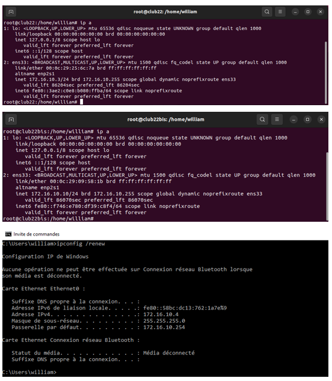
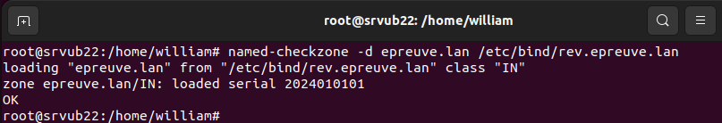
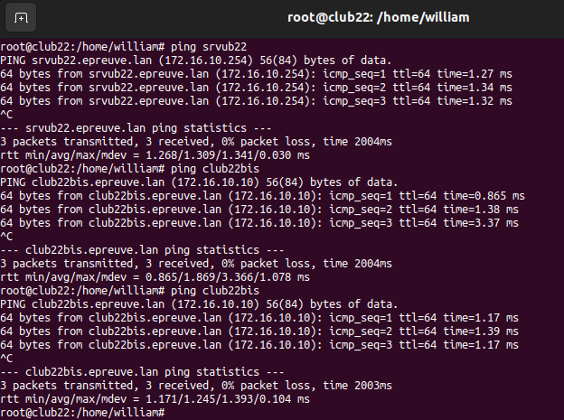
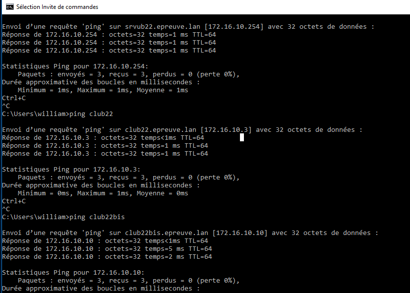

# Serveur DHCP & Serveur DNS - Cas pratique

## Informations

| Champ           | Détails                                      |
|-----------------|----------------------------------------------|
| **Auteur**      | William Mbakop                               |
| **Date**        | 12 janvier 2025                               |
| **Description** | Serveur DHCP & Serveur DNS - Cas pratique         |


# Architecture

La VM serveur srvub22 fera office de serveur DHCP et DNS.

Les VMs clientes club22 et clwin10 seront connectées au serveur DHCP pour obtenir une adresse ip automatique dans la plage d’adresse 172.16.10.3 à 172.16.10.9 (configurée dans le serveur DHCP). Elles obtiendront la résolution de nom (epreuve.lan) par le serveur DNS.

La VM cliente club22bis sera connectée au serveur DHCP pour obtenir une adresse ip statique 172.10.16.10 (configurée dans le serveur DHCP). Elle obtiendra la résolution de nom (epreuve.lan) par le serveur DNS.


# Configuration des switches virtuels
Pour cette configuration, Nous aurons deux switches virtuels :
- VMnet1 qui servira de réseau local
- VMnet8 qui nous permettra d’aller sur internet

### Explication

Les interfaces vmnet1 et vmnet8 sont des interfaces réseau virtuelles créées par VMware Workstation pour la gestion des connexions réseau entre les machines virtuelles (VM) et le système hôte. 

Ces interfaces permettent à VMware de simuler différents types de réseaux pour les machines virtuelles. Voici une explication détaillée de chaque interface :

#### vmnet1 : Réseau hôte-unique (Host-Only)

- Type de réseau : Host-Only (Hôte-Uniquement).

- Description : Cette interface permet aux machines virtuelles de communiquer uniquement entre elles et avec l'hôte (le système physique). Aucun accès à Internet ou au réseau externe n'est fourni via cette interface.

- Utilisation : Elle est utile lorsque vous souhaitez créer un réseau isolé entre vos machines virtuelles et l'hôte, mais sans qu'elles ne soient accessibles depuis le réseau local ou Internet.

- Exemple d'utilisation : Tester des configurations réseau internes sans interaction avec le monde extérieur.

2. vmnet8 : Réseau NAT (Network Address Translation)

- Type de réseau : NAT (Network Address Translation).

- Description : Cette interface permet aux machines virtuelles de se connecter à Internet ou à d'autres réseaux externes via l'hôte, en utilisant la translation d'adresses réseau (NAT). Cela signifie que les machines virtuelles peuvent accéder à Internet, mais les connexions entrantes ne sont pas directement accessibles depuis l'extérieur.

- Utilisation : Elle est idéale lorsque vous souhaitez permettre aux machines virtuelles d'accéder à Internet sans exposer leurs adresses IP internes au monde extérieur.

- Exemple d'utilisation : Accéder à Internet dans une machine virtuelle tout en maintenant une certaine sécurité, car l'hôte gère l'accès externe.


# Installation des VMs

### Installation

Pour la création de la machine virtuelle, se référer à la documentation suivante :
- [Création Machine virtuelle](https://github.com/WilliamMbakop/bts-sisr-installation-machine-virtuelle-vmware-worsktation-pro-17/blob/master/creation_machine_virtuelle.md)

Les caractéristiques de la VM srvub22 sont les suivantes :
- Ubuntu 22.04.5 : [iso à télécharger ici](https://releases.ubuntu.com/jammy/ubuntu-22.04.5-desktop-amd64.iso)
- Ram 4 Go
- Network adaptator1 : NAT (VMNet8)
- Network adaptator2 : VMnet1
- Décocher Accélération 3D graphics

Les caractéristiques de la VM club22 et club22bis sont les suivantes :
- Ubuntu 22.04.5 : [iso à télécharger ici](https://releases.ubuntu.com/jammy/ubuntu-22.04.5-desktop-amd64.iso)
- Ram 4 Go
- Network adaptator1 : VMnet1
- Décocher Accélération 3D graphics

Les caractéristiques de la VM clwin10 sont les suivantes :
- Windows 10 pro
- Ram 4 Go
- Network adaptator1 : VMnet1
- Décocher Accélération 3D graphics

Après installation de la VM clwin10, ne pas oublier de renommer la machine :

-  Ouvrir les paramètres : Cliquer sur le bouton Démarrer et sélectionner Paramètres (l'icône en forme de roue dentée).

-  Accéder à "Système" : Aller dans Système > Informations système.

-  Changer le nom de l'ordinateur : Cliquer sur Renommer ce PC en haut à droite.

-  Entrer un nouveau nom : Taper le nouveau nom d'ordinateur et cliquez sur Suivant.

-  Redémarrer l'ordinateur : Vous serez invité à redémarrer votre PC pour appliquer le changement.

# Affichage des interfaces réseaux

## Pour les VMs Linux :

Ouvrir le terminal en tapant *ctrl + alt + t*

```bash
ip a
```

## Pour la VM Windows :

Ouvrir l'invite de commande en tapant *cmd* dans la zone de saisie qui se trouve dans la barre de tâches

```bash
ipconfig
```


# Configuration du serveur DHCP sur la VM srvub22

Ouvrir le terminal en tapant *ctrl + alt + t*

Passer en mode superutilisateur (root) en utilisant les privilèges de l'utilisateur courant
```bash
sudo su
```

Créer un fichier vide nommé script.sh
```bash
touch script.sh
```

Changer les permissions du fichier script.sh pour que tout le monde puisse lire, écrire et exécuter
```bash
chmod 777 script.sh
```

Ouvrir le fichier script.sh dans l'éditeur de texte nano
```bash
nano script.sh
```

Renseigner les lignes ci-dessous dans le fichier :
```bash
# Mettre à jour la liste des paquets disponibles à partir des sources configurées
apt update -y

# Effectuer une mise à niveau de distribution, incluant des mises à jour de paquets et des changements de dépendances
apt dist-upgrade -y

# Installer le programme "tasksel" qui permet d'installer des tâches prédéfinies pour une configuration plus facile
apt install tasksel -y

# Installer le serveur SSH, permettant l'accès à distance sécurisé via SSH
apt install openssh-server -y

# Installer les outils Open VM Tools, nécessaires pour les machines virtuelles VMware
apt install open-vm-tools -y

# Installer le programme "tree" pour afficher les répertoires sous forme d'arborescence
apt install tree -y
```

Exécuter le script script.sh
```bash
./script.sh
```

Afficher les informations sur les interfaces réseau et leurs adresses IP
```bash
ip a
```

Ouvrir le fichier /etc/netplan/01-network-manager-all.yaml
```bash
sudo nano /etc/netplan/01-network-manager-all.yaml
```
Renseigner le code ci-dessous. Attention à l'identifiant de la seconde carte réseau :
```bash
network:
    version: 2
    renderer: NetworkManager
    ethernets:
        ens33:
            dhcp4: true
            optional: true
        ens34:
            dhcp4: false
            addresses:
                - 172.16.10.254/24
```

Changer les permissions du fichier de configuration réseau pour qu'il soit lisible et modifiable uniquement par le propriétaire
```bash
sudo chmod 600 /etc/netplan/01-network-manager-all.yaml
```

Appliquer les configurations réseau définies dans les fichiers de configuration Netplan
```bash
sudo netplan apply
```

Observer les changements effectués
```bash
ip a
```


Installer le serveur DHCP ISC, qui attribue des adresses IP aux clients du réseau
```bash
sudo apt install isc-dhcp-server -y
```

Ouvrir le fichier de configuration DHCP
```bash
sudo nano /etc/dhcp/dhcpd.conf
```

Commenter :

```bash
#option domain-name "example.org";
#option domain-name-servers ns1.example.org, ns2.example.org;
```
Modifier :

```bash
default-lease-time 86400;
max-lease-time 604800;
```

```bash
#ddns-update-style none;
```

Décommenter authoritative :
```bash
authoritative
```

Ajouter :
```bash
subnet 172.16.10.0 netmask 255.255.255.0 {
    deny client-updates;
    one-lease-per-client on;    
    option routers 172.16.10.254;
    option broadcast-address 172.16.10.255;

    pool {
        deny dynamic bootp clients;
        range 172.16.10.3 172.16.10.9;
        host club22bis { hardware ethernet 00:0c:29:09:58:1b; fixed-address 172.16.10.10;}
    }
}
```

Ouvrir le fichier de configuration du serveur DHCP ISC
```bash
sudo nano /etc/default/isc-dhcp-server
```
Modifier INTERFACESv4 :
```bash
INTERFACESv4="ens34"
```

Commenter INTERFACESv6=""
```bash
#INTERFACESv6=""
```

Redémarrer le service DHCP ISC pour appliquer les nouvelles configurations
```bash
sudo systemctl restart isc-dhcp-server
```

Configurer le service DHCP ISC pour qu'il démarre automatiquement au démarrage de votre VM
```bash
sudo systemctl enable isc-dhcp-server
```

Vérifier que le serveur DHCP fonctionne correctement
```bash
sudo systemctl status isc-dhcp-server
```

# Test du bon fonctionnement du DHCP

## Pour les VMs club22 et club22bis

```bash
sudo systemctl restart NetworkManager
ip a
```

## Pour la VM clwin10


```bash
ipconfig /renew
```



# Configuration de la résolution locale des noms d'hôte en adresses IP sur la VM serveur svrub22 

```bash
# Ouvrir le fichier /etc/hosts 
nano /etc/hosts
```

Ajouter ces lignes

```bash
127.0.0.1       localhost
172.16.10.254   srvub22
172.16.10.3     club22
172.16.10.4     clwin10 
172.16.10.10    club22bis
8.8.8.8         www.google.fr
8.8.4.4         www.google.fr
```
Redémarrer le service NetworkManager pour appliquer les changements de configuration réseau

```bash
systemctl restart NetworkManager
```

Réaliser des tests


# Configuration du serveur DNS (bind9) sur srvub22

Modifier le fichier /etc/netplan/01-network-manager-all.yaml

```bash
sudo nano /etc/netplan/01-network-manager-all.yaml
```

```bash
network:
    version: 2
    renderer: NetworkManager
    ethernets:
        ens33:
            dhcp4: true
            optional: true
        ens34:
            dhcp4: false
            addresses:
                - 172.16.10.254/24
            nameservers:
                addresses:
                    - 172.16.10.254
                search:
                    - epreuve.lan
```

NB: 

- "nameservers addresses" : Cette section spécifie les adresses IP des serveurs DNS que le système doit utiliser pour résoudre les noms de domaine. Ainsi, `172.16.10.254` est configuré comme serveur DNS.


- "search" : Cette section permet à tous les clients du réseau local d’utiliser automatiquement le domaine epreuve.lan lorsqu'ils résolvent des noms de domaine. Ainsi, par exemple les machines du réseau peuvent résoudre des noms de type srvub22 en srvub22.epreuve.lan  ou club22 en club22.epreuve.lan sans avoir besoin de spécifier le domaine complet. 

Appliquer les configurations réseau définies dans les fichiers de configuration Netplan

```bash
sudo netplan apply
```

Ouvrir le fichier /etc/hosts 
```bash
nano /etc/hosts
```

```bash
127.0.0.1       localhost
172.16.10.254   srvub22.epreuve.lan     srvub22
172.16.10.3     club22.epreuve.lan      club22
172.16.10.6     clwin10.epreuve.lan     clwin10 
172.16.10.10    club22bis.epreuve.lan   club22bis
8.8.8.8         www.google.fr
8.8.4.4         www.google.fr
```

Redémarrer le service NetworkManager pour appliquer les changements de configuration réseau

```bash
systemctl restart NetworkManager
```

Ouvrir le fichier de configuration DHCP

```bash
sudo nano /etc/dhcp/dhcpd.conf
```
Décommenter et modifier :

```bash
option domain-name "epreuve.lan";
option domain-name-servers srvub22.epreuve.lan;
```

Modifier :

```bash
subnet 172.16.10.0 netmask 255.255.255.0 {
    deny client-updates;
    one-lease-per-client on;    
    option routers 172.16.10.254;
    option broadcast-address 172.16.10.255;

    pool {
        deny dynamic bootp clients;
        range 172.16.10.3 172.16.10.9;
        host club22bis { hardware ethernet 00:0c:29:09:58:1b; fixed-address 172.16.10.10;}
    }
    # Mise à jour automatique DNS pour les clients
    ddns-updates on;
    update-static-leases on;
}
```

Redémarrer le service DHCP ISC pour appliquer les nouvelles configurations
```bash
sudo systemctl restart isc-dhcp-server
```


## Installation des paquets Bind9


```bash
apt install bind9 -y && apt install bind9utils -y && apt install bind9-doc -y
```

## Définition des zones DNS

Les zones DNS servent à organiser et gérer la correspondance entre les noms de domaine (comme srvub22.epreuve.lan) et leurs adresses IP, en permettant la résolution des noms au sein d'un domaine spécifique.


 Ouvrir le fichier de configuration local de BIND : /etc/bind/named.conf.local. Il sert à définir les zones DNS locales et à configurer des fichiers de zone spécifiques pour un serveur DNS Bind9, permettant ainsi la gestion des domaines et de leurs enregistrements.

 ```bash
sudo nano /etc/bind/named.conf.local
```
Ajouter ces lignes :

```bash
zone "epreuve.lan" {
    type master;
    file "/etc/bind/db.epreuve.lan";
    allow-update { any; };
};

zone "10.16.172.in-addr.arpa" {
    type master;
    file "/etc/bind/rev.epreuve.lan";
    allow-update { any; };
};
```
NB : allow-update { any; }; permet d'autoriser n'importe quel client à effectuer des mises à jour dynamiques des enregistrements DNS sur le serveur.

## Création de la zone directe

NB : La zone directe permet de résoudre un nom de domaine en adresse IP (par exemple, srvub22.epreuve.lan → 192.168.1.10).

Ouvrir le fichier de zone DNS pour epreuve.lan

```bash
sudo nano /etc/bind/db.epreuve.lan
```

Ajouter le code ci-dessous : 

```bash
$TTL    604800
@       IN      SOA     srvub22.epreuve.lan. root.epreuve.lan. (
                        2025011161 ; Serial
                        1W         ; Refresh
                        1d         ; Retry
                        4W         ; Expire
                        1W )       ; Negative Cache TTL

        IN      NS      srvub22.epreuve.lan.
        IN      A       172.16.10.254
www     IN      A       172.16.10.254

srvub22  IN      A       172.16.10.254
club22   IN      A       172.16.10.3
club22bis IN     A       172.16.10.10
clwin10  IN      A       172.16.10.4
```

## Création de la zone inversée

NB : La zone inversée permet de résoudre une adresse IP en son nom de domaine associé (par exemple, 192.168.1.10 → srvub22.epreuve.lan). 

Ouvrir le fichier de zone inversée DNS pour epreuve.lan

```bash
sudo nano /etc/bind/rev.epreuve.lan
```

Ajouter le code ci-dessous : 

```bash
$TTL    604800
@       IN      SOA     srvub22.epreuve.lan. root.epreuve.lan. (
                        2025011161 ; Serial
                        1W         ; Refresh
                        1d         ; Retry
                        4W         ; Expire
                        1W )       ; Negative Cache TTL

        IN      NS      srvub22.epreuve.lan.

srvub22 IN      A       172.16.10.254

254     IN      PTR     srvub22.epreuve.lan.
3       IN      PTR     club22.epreuve.lan.
10      IN      PTR     club22bis.epreuve.lan.
4       IN      PTR     clwin10.epreuve.lan.
```

Effectuer les changements des droits et groupes des fichiers db.epreuve.lan et rev.epreuve.lan

```bash
sudo chown bind:bind /etc/bind/*
```

Redémarrage de Bind9 et affichage de son status

```bash
sudo systemctl restart bind9 && sudo systemctl status bind9
```

#### Réalisation de tests
```bash
# Test du fichier /etc/bind/named.conf.local

named-checkconf
```


*Comme on peut le constater, aucun message d'erreur s'affiche*

```bash
# Test du fichier /etc/bind/db.epreuve.lan

named-checkzone -d epreuve.lan /etc/bind/db.epreuve.lan
```


```bash
# Test du fichier /etc/bind/rev.epreuve.lan

named-checkzone -d epreuve.lan /etc/bind/rev.epreuve.lan
```



```bash
# Tests de requête DNS sur epreuve.lan et www.epreuve.lan

dig @172.16.10.254 epreuve.lan 
dig @172.16.10.254 www.epreuve.lan
```


Sur les VMs clientes Linux (club22 et club22bis)

```bash
systemctl restart NetworkManager
```

Sur la VM cliente Windows (clwin10s)

```bash
ipconfig /renew
```

et autoriser le trafic entrant et sortant du pare-feu pour le protocole ICMP

Pour chacun des protocoles ICMPv4, le but est d’activer et d’autoriser la connexion pour le trafic entrant et pour le trafic sortant


Faire les tests de résolution DNS








Tout fonctionne comme on le souhaite.

Il ne reste plus qu'à donner l'accès à Internet aux Vms clientes.

En efft, pour le moment, elles n'ont pas accès à Internet.

Ex. sur une VM cliente, essayer de pinguer 8.8.8.8


Pour leur permettre d'accéder à Internet, nous allons configurer le forwarding et les regles ipTables sur la VM serveur srvub22 

# Activation du Forwarding et de la translation d'adresses (NAT) sur srvub22

```bash
# Ouvrir le fichier /etc/sysctl.conf
sudo nano /etc/sysctl.conf

    # Décommenter :
    net.ipv4.ip_forward=1

# NB : La commande net.ipv4.ip_forward=1 active le forwarding en permettant au système de transférer les paquets entre différentes interfaces réseau, ce qui est nécessaire pour le routage, et prépare le serveur à utiliser la translation d'adresses (NAT) en modifiant les adresses IP source des paquets pour permettre l'accès à Internet via une adresse publique. 

# Recharger les paramètres de configuration du noyau à partir du fichier /etc/sysctl.conf
sudo sysctl -p
```


# Configuration du Masquage avec IPTABLES sur srvub22

```bash
# Ajouter une règle NAT pour masquer les adresses IP source des paquets sortants sur l'interface ens33. Cela assure que tout le trafic sortant de la VM cliente passe par l’interface ens33 du serveur et est correctement masqué. 
sudo iptables -t nat -A POSTROUTING -o ens33 -j MASQUERADE

# Installer le paquet iptables-persistent pour sauvegarder les règles iptables
sudo apt install iptables-persistent -y

# Répondre OUI aux deux questions
```

Sun une VM cliente, essayer de pinguer de nouveau 8.8.8.8


